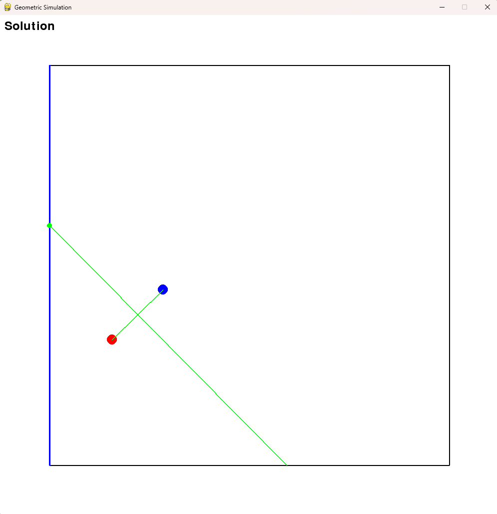
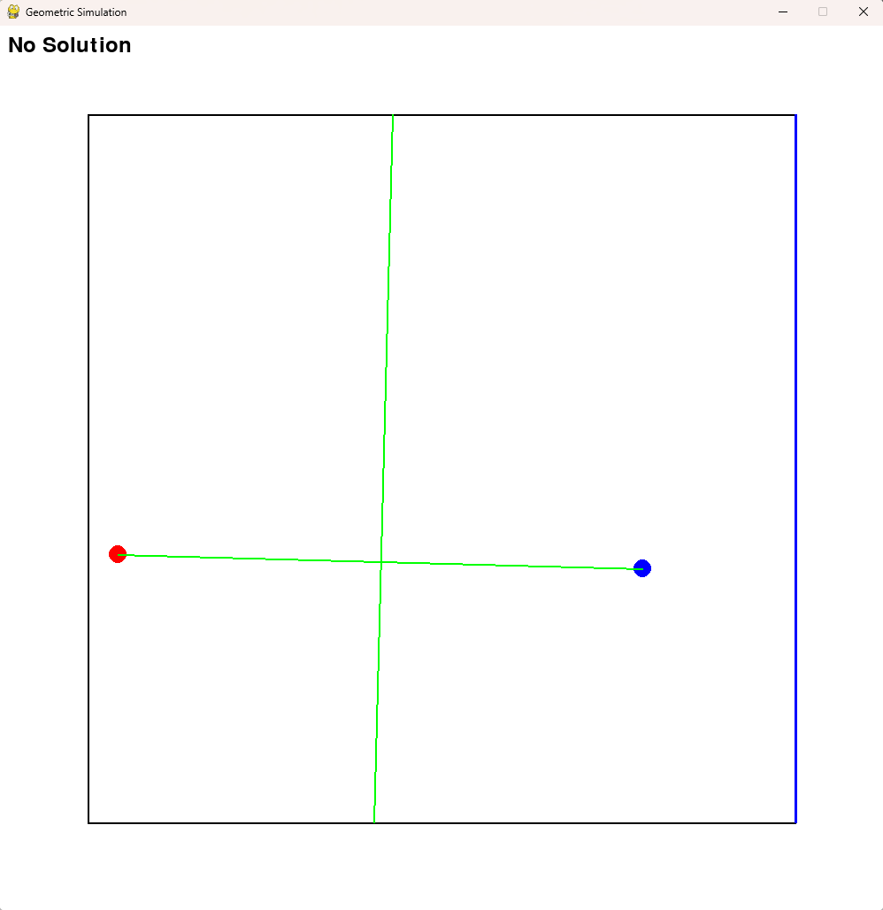

# BesideThePoint

## Problem Overview
This project is an attempt to solve the [Jane Street Beside The Point Problem](https://www.janestreet.com/puzzles/beside-the-point-index/) using the Brutest of Forces.
The essence of the problem is as follows:
- You have a square and you independently and uniformly pick two random points inside the square, red and blue.
- You find the side of the square that is closest to the blue point, call that the blue side.
- Check: Is there a point on the blue side of the square that is equidistant to both the red and the blue point?
  - ie. Is there a point on the blue side that is equally far from the red/blue point? 
- If there is, you have a solution. If there is not, you have no solution.
- **What is the probability that by picking two random points, you will have a solution?**

You can see this example has a solution (the green point on the blue side is equidistant to both red and blue):

And this example has no solution (there is no point on the blue side that is of equal distance to both red and blue)

## Detecting if There is a Solution
It's very simple to pick two points inside a square, but how do we actually detect if there is a solution?
Well, what we can do is draw a line between the two points. Let's call it line A.
We can calculate the equation (and slope) of this line because we know two points that it passes through.
Then, draw a line (line B) that goes through the center of line A
and make line B perpendicular to line A.
This is called a perpendicular bisector.
We can also solve for the equation and slope of line B
(we know it goes through the midpoint between Blue and Red and we know its slope is the negative reciprocal of line A).
Finally, we check if line B intersects with the blue side inside of the box.
We know the blue side has a fixed x or y (ie top and bottom have fixed y, left and right have fixed x).
We can plug this (either x or y) into our perpendicular bisector formula and get the other coordinate.
If this is other coordinate is within the box (between 0 and 1 in our case),
then the perpendicular bisector intersects and there is a solution.
Otherwise, there is no solution.
The code that does this is present in `BesideThePoint.py`.

## Computational Approach
This project attempted to brute force the solution to this problem by running a large number of simulations (or trials)
and evaluating the probability of there being a solution that way.
I attempted different approaches to optimize the speed of running a lot of simulations.
This included:
- `ComputeSimple.py` - A simple for loop that runs a lot of trials
- `ComputeMultithread.py` - An attempt to use multiple threads to make computations faster
- `ComputeMultiprocess.py` - Using multiple processes to parallelize the trials
- `ComputeNumpy.py` - Uses Numpy and multiple processes to vectorize (run many at once) and parallelize the trials
- `ComputeCupy.py` - Uses your GPU via Nvidia CUDA to run many vectorized trials

Each approach yielded different results and it was interesting to see which were faster and by how much.

## Solution Overview
The Jane Street problem required 10 decimal places of accuracy in the solution. At first, this seemed do-able.
But as it turned out, it is impossible to run enough trials to get this level of accuracy
(it would take 25,000 years on my laptop RTX 4070).
I made this calculation, by using the Standard Error for a binomial process formula.
SE = \sqrt{\frac{\hat{p}(1 - \hat{p})}{n}}
I then set the required accuracy (for 10 decimal places, SE must be less than 5 x 1011)
and calculated n (number of trials).
This allows us to find the time it would take (as we know the speed at which we are running trials).

## Performance Overview
I ran all the different versions of Compute and tracked their performance as well as the resulting probability:
...
The real solution is: `0.4914075788`
Our best estimate: `...` with SE `XYZ`

By running for X hours, I got within Y decimal places of accuracy.

It's interesting to see how much performance changes based on the coding approach and library used.
`ComputeSimple.py` is the simplest approach using only a for loop and nothing else.
My first attempt at improving, `ComputeMultithread.py`,
failed because it used multithreading which [runs into the GIL problem in Python](https://grok.com/share/bGVnYWN5_436d62d6-102e-4804-ac55-6e82dc915a13).
I did better with `ComputeMultiprocess.py` which used multiple processes rather than threads.
This avoided the GIL problem, but required careful use of multiprocessing Values so processes could combine the trials they ran.
Using NumPy (still running on CPU) blew my multiprocessing script out of the water.
Vectorizing the trials was really something (running and computing the results of many simulations at once).
Finally CuPy, which is basically NumPy, but for CUDA (Nvidia GPU library) did even better
and did not require me to handle multiprocessing myself.

You can see the performance data I got and [performance report](./example_data/performance-report.txt) in `example_data/`.

## Run It Yourself
Run `.venv\Scripts\activate` on Windows to activate venv